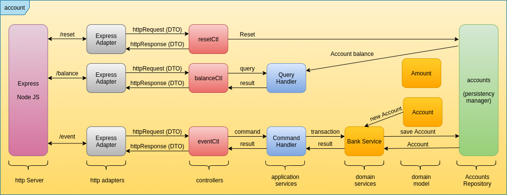

### Hi there 👋

- 🔭 I’m currently working on DDD Hexagonal Systems
- 🌱 I’m currently learning AWS CDK and Rust
- 👯 I’m looking to collaborate on Building Scalable MVPs
- 🤔 I’m looking for help with Remote Opportunities in the US, Europe, or Australia
- :rocket: I'm experimenting Serverless Hexagonal Systems
- 💬 Ask me about Software Architecture, Serverless & Event Driven Architectures
- 📫 How to reach me: https://www.linkedin.com/in/gpazevedo/
- ⚡ Fun fact: I feel like "I'm Back to School !"

*Bank Account API*

  
*Shop Accounting*
