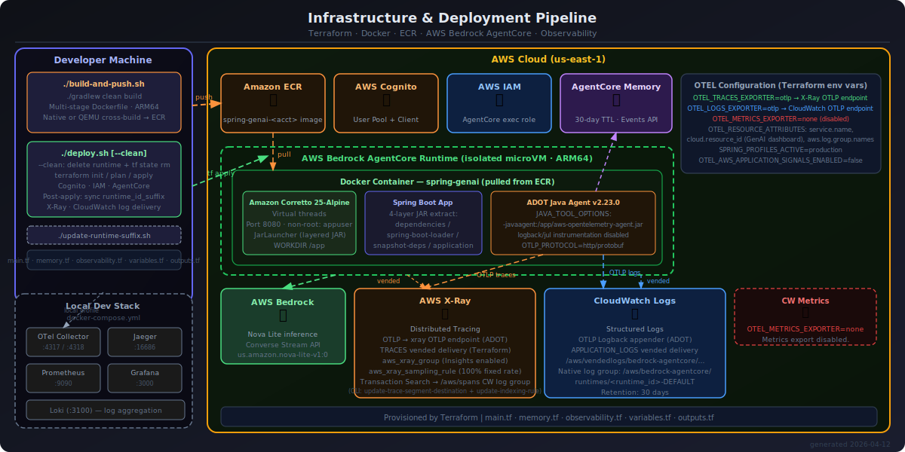
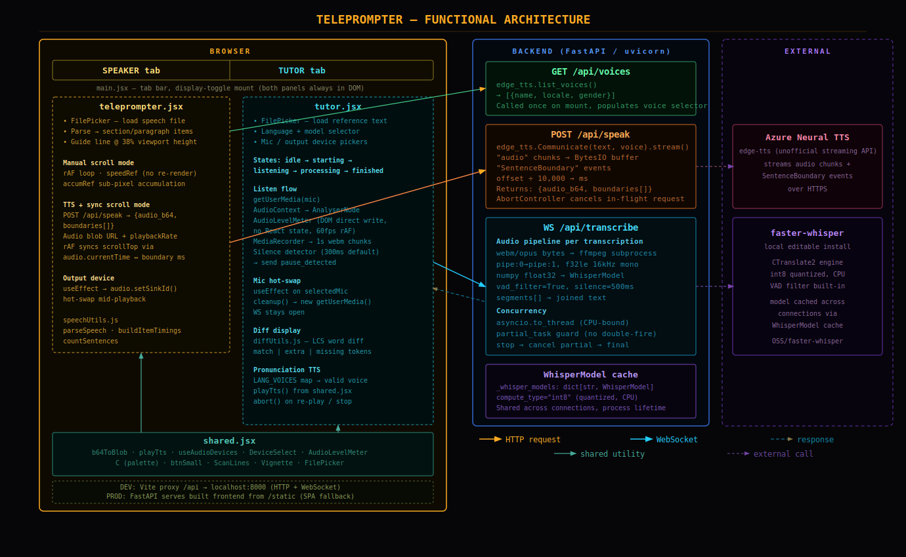
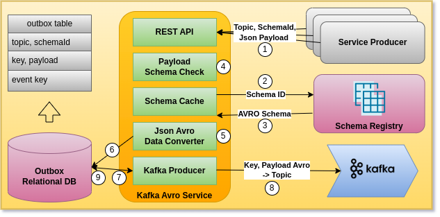
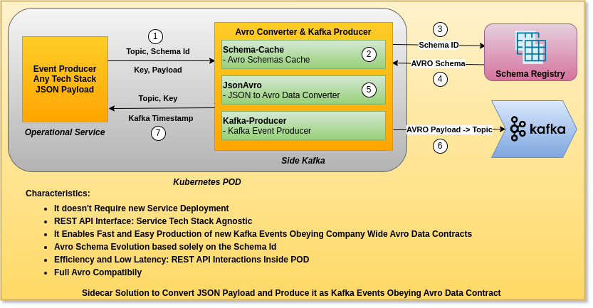
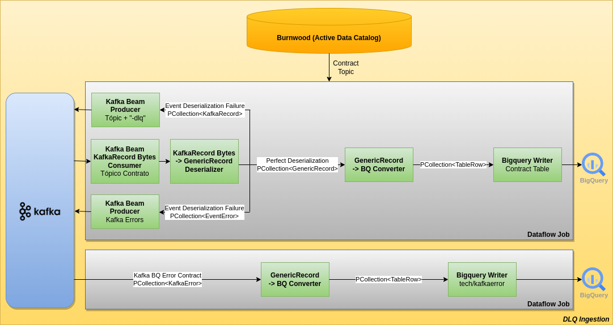
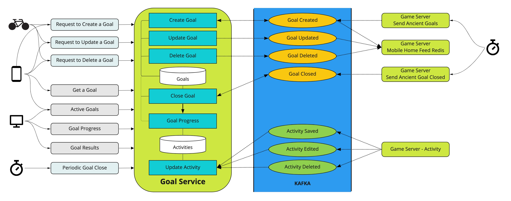
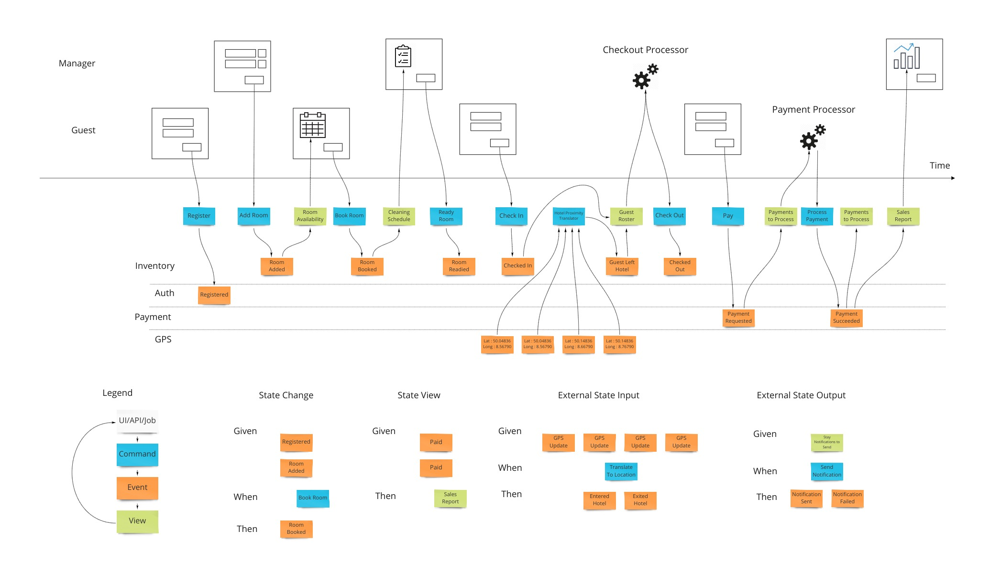
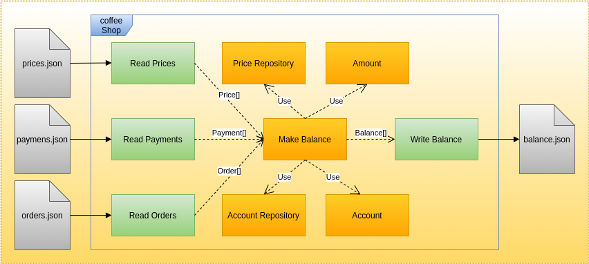

### Hi there 👋

- 🔭 I'm currently Building AI/ML Infrastructure & Platforms
- 🌱 I’ve worked to Improve Developer Experience in Generative AI, Agentic Systems, and Event-Driven Systems
- 💻 Playing with Strands, LangGraph, MCP, KubeFlow, MLFlow.
- 👯 I’m looking to collaborate on AI Open Source Projects
- 🤔 I’m looking for Disruptive AI/ML Use Cases
- 🚀 I'm learning BedRock AgentCore
- 💬 Ask me about AI, Software Architecture, Observability, DDD, Data Mesh, CDC & Event-Driven Architecture
- 📫 How to reach me: https://www.linkedin.com/in/gpazevedo/
- ⚡ Fun fact: I feel like "I'm Back to School !"

* Basic Generative AI app, built with Spring Boot 4, Spring AI 2 with full Observability, deployed at AWS Bedrock AgentCore *

* Browser-based AI Teleprompter for public speakers *

*Contract-based production of Avro events from a JSON payload to a Kafka Topic. Service converts a JSON payload to an Avro payload based on a verified schema and publishes it to a Kafka topic, using the Outbox Pattern*

*Sidecar that converts a JSON payload to Avro payload based on a verified schema and publishes it to a Kafka topic*

*Kafka Dead Letter Queue on Apache Beam*

*Goals Service*

*Hotel Event Modelling*

*Syncronous Bank API*

  
*Shop Accounting*
