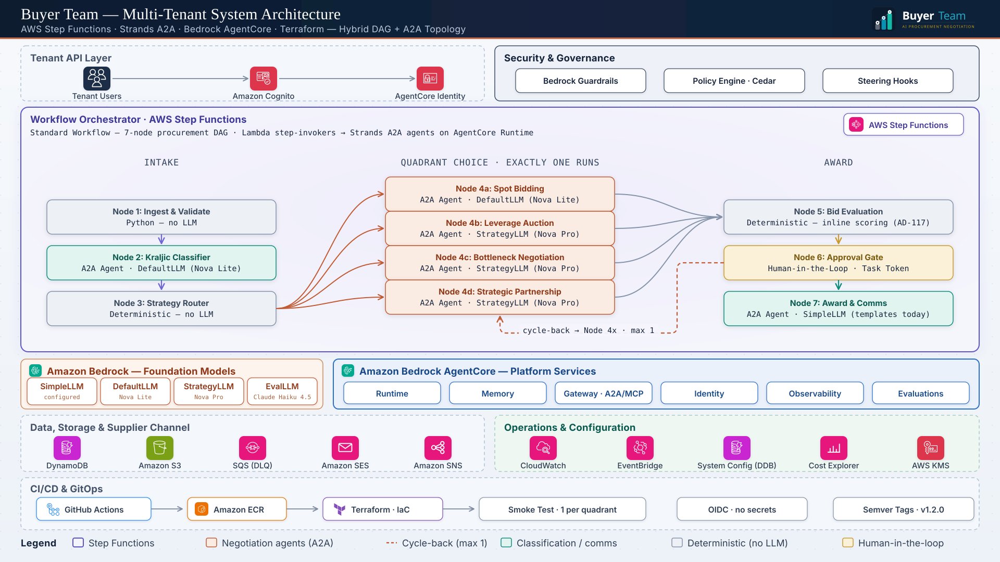
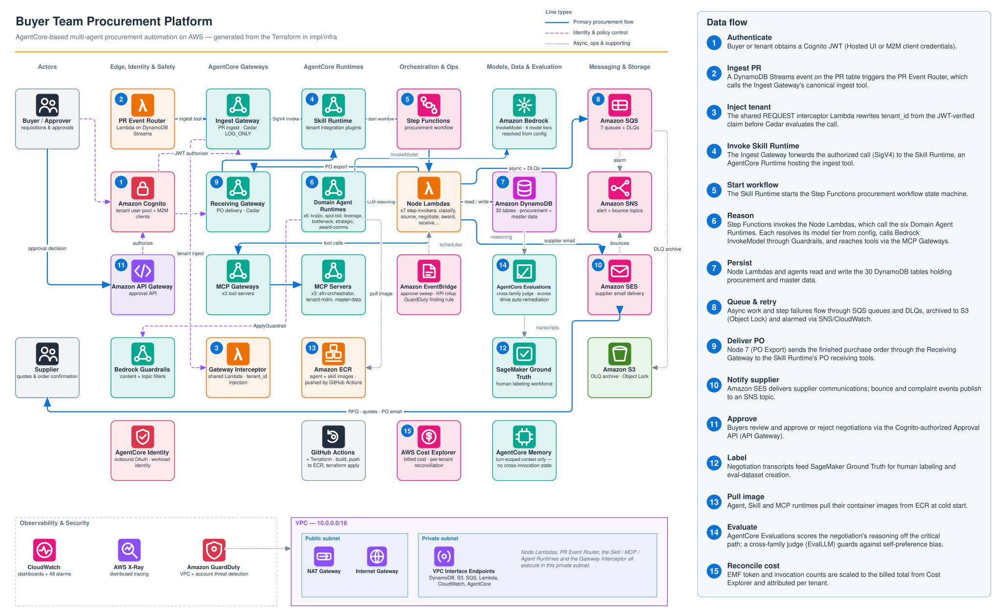
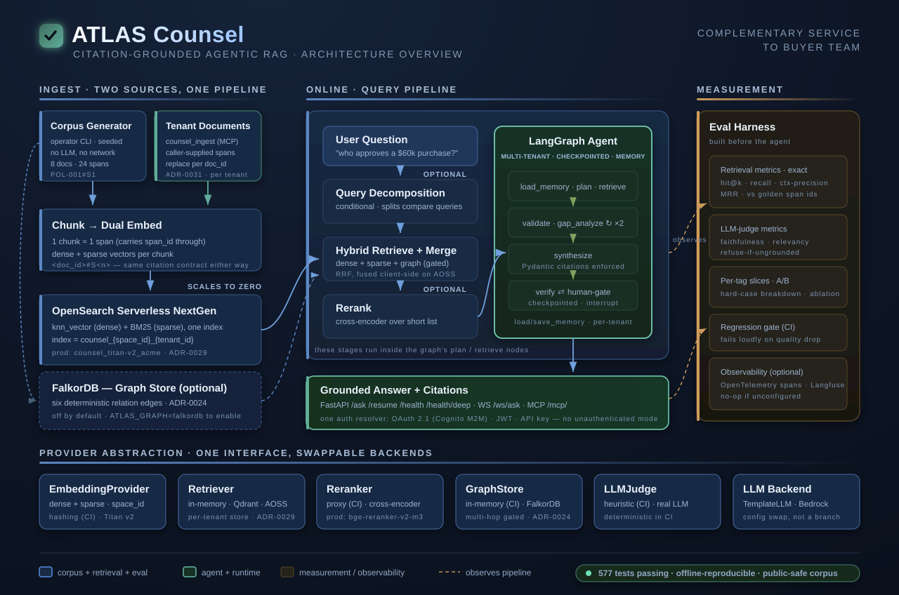
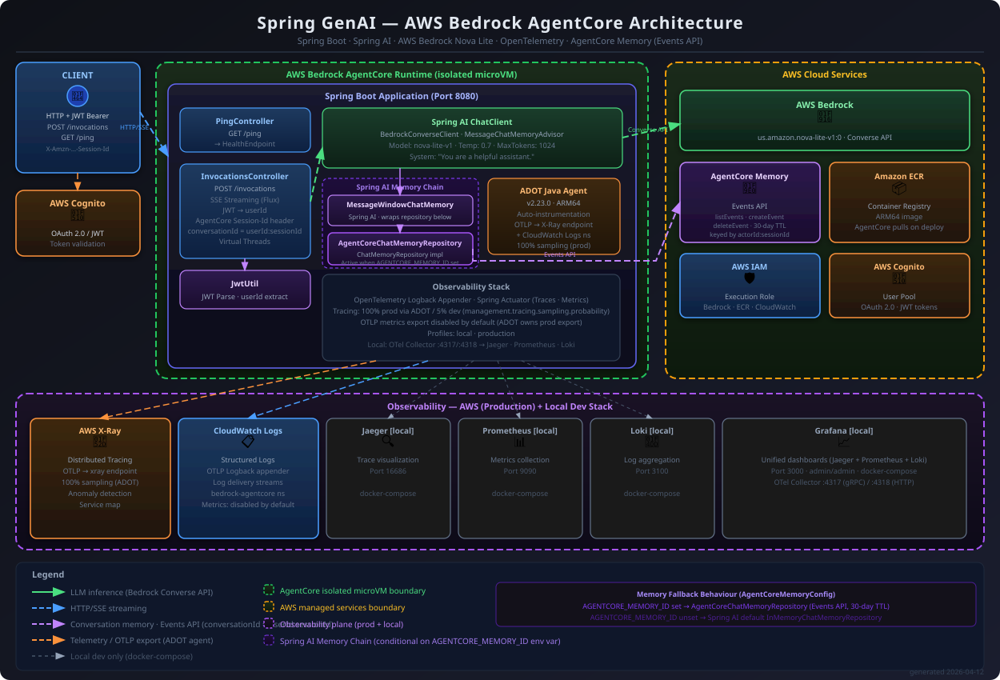
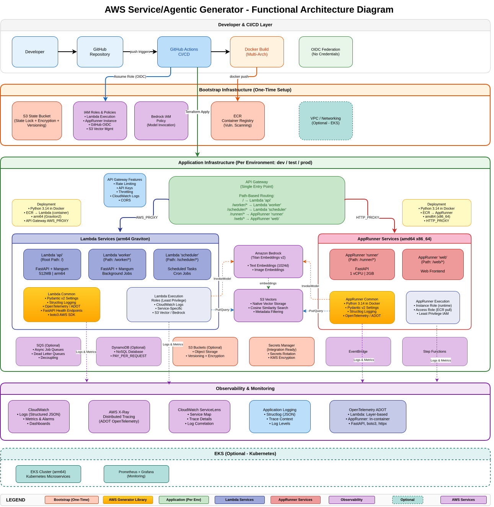
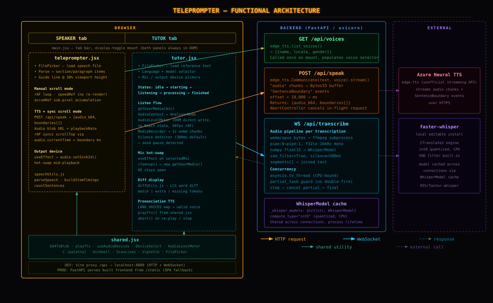
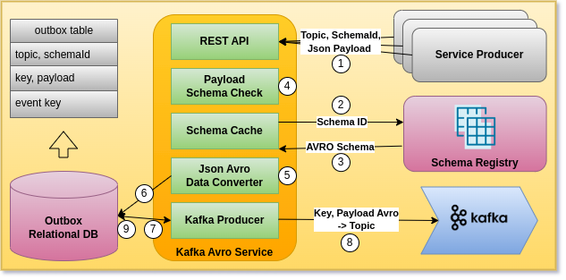
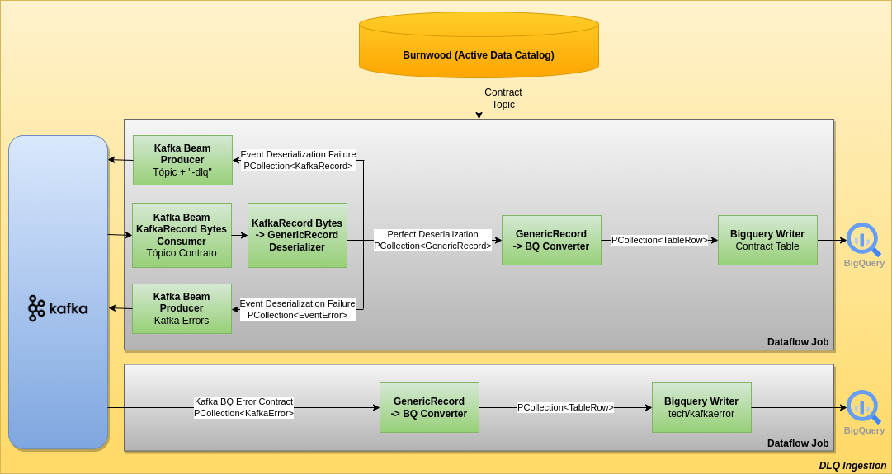

# Gustavo Peixoto de Azevedo

**AI Solution Architect — Agentic Systems · Bedrock AgentCore · Strands · Event-Driven Architectures**

I design and build production agentic systems end-to-end — from business concept to production
and evolution. 25+ years architecting business and distributed systems. M.Sc. Computer & Systems
Engineering, UFRJ.

🔗 [buyer-team.com](https://buyer-team.com) · [About / CV](https://buyer-team.com/about.html) ·
[LinkedIn](https://www.linkedin.com/in/gpazevedo/) · ✉️ <gustavo.peixoto.de.azevedo@gmail.com>

> **Open to senior architect and IC roles building agentic systems.** If your team is building
> production agents and wants someone who has shipped one end-to-end — let's talk.

---

## 🚀 Current build — Buyer Team

**[Buyer Team](https://buyer-team.com)** is my flagship: an autonomous, multi-tenant
procurement-negotiation platform I architected and built end-to-end on **Amazon Bedrock AgentCore**
and the **Strands Agents SDK**.

It ingests purchase requisitions, classifies them on the **Kraljic matrix** (profit impact × supply
risk), routes each to the right negotiation strategy — spot bid, competitive auction, risk-managed
partnership, or strategic engagement — and runs the full cycle autonomously: supplier invitations,
multi-round bidding, evaluation against governance rules, and Purchase Order assembly. All audited,
at **minimum AI cost per negotiation** via a four-layer cost-optimization architecture.

Buyer Team on AWS, generated from the Terraform: Cognito and AgentCore gateways at the edge, a Step Functions workflow driving seven step-invoker Lambdas and six negotiation agents, Bedrock model tiers behind Guardrails, DynamoDB checkpoints, SQS with DLQs, SES delivery, and an evaluation loop into SageMaker Ground Truth. Runtimes execute in private subnets behind VPC endpoints.

**Business write-ups:**

- [The 80% Problem: why tail spend never gets negotiated](https://buyer-team.com/blog/procurement/the-80-percent-problem.html)

**Engineering write-ups:**

- [Why we chose a deterministic DAG over a pure LLM planner](https://buyer-team.com/blog/eng/dag-vs-llm-planner.html)
- [Why we chose Bedrock AgentCore to run Buyer Team](https://buyer-team.com/blog/eng/why-we-chose-agentcore)
- [How we decided to build Buyer Team](https://buyer-team.com/blog/eng/why-we-chose-strands)
- [How we implemented durable execution in Buyer Team](https://buyer-team.com/blog/eng/durable-orchestration)
- More at [buyer-team.com](https://buyer-team.com)

**LinkedIn posts**

- [How we chose where to run Buyer Team's Agents](https://www.linkedin.com/feed/update/urn:li:ugcPost:7469743193010663424?commentUrn=urn%3Ali%3Acomment%3A%28ugcPost%3A7469743193010663424%2C7469768631191584769%29&dashCommentUrn=urn%3Ali%3Afsd_comment%3A%287469768631191584769%2Curn%3Ali%3AugcPost%3A7469743193010663424%29)
- [How we decided how to build Buyer Team's Agents](https://www.linkedin.com/feed/update/urn:li:ugcPost:7470575803668353024?commentUrn=urn%3Ali%3Acomment%3A%28ugcPost%3A7470575803668353024%2C7470734283976945666%29&dashCommentUrn=urn%3Ali%3Afsd_comment%3A%287470734283976945666%2Curn%3Ali%3AugcPost%3A7470575803668353024%29)

## 🚀 Current build — Atlas Counsel

**ATLAS Counsel** — a procurement-knowledge RAG agent that answers buyers' questions ("what does our policy say about single-source justification above $50k?", "summarize the SLA clauses across these three vendor contracts") with citation-grounded answers, and a negotiation pre-brief generator.

## Spring GenAI

Spring GenAI answers a question that surfaces early in most enterprise GenAI conversations: can an organization put its existing Java stack on a managed agent runtime without rewriting it in Python? Amazon Bedrock AgentCore's reference material assumes Python, so the path for a Spring Boot team is undocumented rather than unsupported — and that difference is where projects stall. The agent itself is deliberately trivial; the deliverable is the proof that everything around it works: the runtime contract, real user authentication, managed conversation state, and full visibility in the operator's telemetry, which is usually what decides whether a workload reaches production. With no domain logic in the way, every difficulty encountered belongs to the platform integration — making the result both a reusable template and an honest account of the friction a Java team should expect.

---

## 🛠 Open-source contributions

- [`awslabs/fullstack-solution-template-for-agentcore`](https://github.com/awslabs/fullstack-solution-template-for-agentcore) — AWS reference AgentCore agentic system
- [`aws-samples/sample-strands-agent-with-agentcore`](https://github.com/aws-samples/sample-strands-agent-with-agentcore) — Strands / Bedrock / AgentCore reference architecture
- [`spring-ai-community/spring-ai-agentcore`](https://github.com/spring-ai-community/spring-ai-agentcore) — Spring AI integration for Bedrock AgentCore
- [`SYSTRAN/faster-whisper`](https://github.com/SYSTRAN/faster-whisper) — fast speech-to-text
- [`sivaprasadreddy/sivalabs-agent-skills`](https://github.com/sivaprasadreddy/sivalabs-agent-skills) — Spring Boot AI skill

## 🧭 Background

Staff Engineer on streaming data platforms (Grupo SBF — Nike Brasil, Centauro) · Platform Engineer
at **Zwift** (300k concurrent users, real-time leaderboards) · Founding-team engineering (Grepr).
Earlier: co-founder & CTO building enterprise systems for Petrobras, GE, and Saint-Gobain;
OS/distributed-systems research at NCE/UFRJ.

Ask me about: agentic systems · AWS Bedrock AgentCore · software architecture · observability ·
DDD · CDC & event-driven architecture.

---

## 📐 Selected architecture work

*Generator of production-ready AWS services and AI-agent skeletons on Lambda / App Runner with full Observability and GitOps*

---

*Browser-based AI teleprompter for public speakers*

---

*Contract-based Avro event production from a JSON payload, using the Outbox Pattern*

---

*Kafka Connector Dead Letter Queue on Apache Beam*
