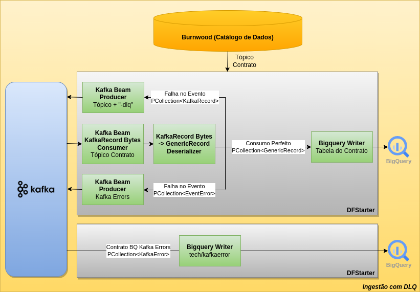

### Hi there 👋

- 🔭 I'm currently Improving Dev Experience on Data Mesh & Real Time Analytics based on GCP, Kafka & Apache Beam
- 🌱 I’ve worked on Reactive Microservices, Quarkus & Kotlin Developed, Kafka & K8s Served at AWS
- 👯 I’m looking to collaborate on Apache Beam & Kafka Development
- 🤔 I’m looking for help with Improving Microservices Developer Experience
- 🚀 I'm experimenting Event Modelling and AsyncAPI
- 💬 Ask me about Software Architecture, Serverless, DDD, Data Mesh & Event Driven Architectures
- 📫 How to reach me: https://www.linkedin.com/in/gpazevedo/
- ⚡ Fun fact: I feel like "I'm Back to School !"

*Kafka Dead Letter Queue on Apache Beam*

*Hotel Event Modelling*

*Syncronous Bank API*

  
*Shop Accounting*
