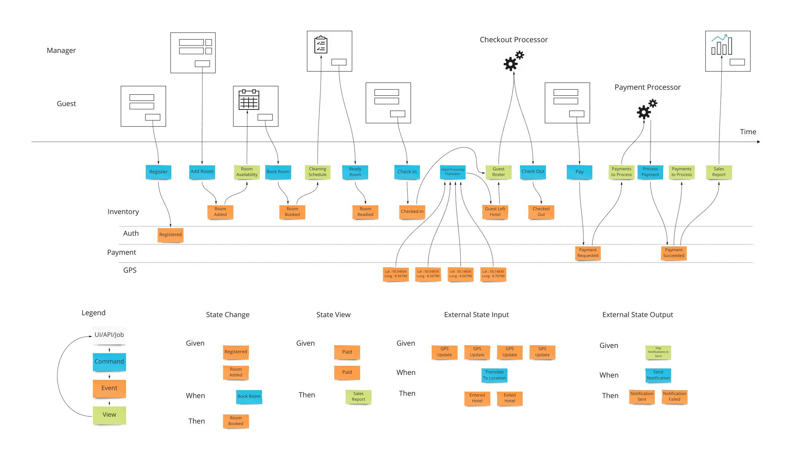

### Hi there 👋

- 🔭 I'm currently Building Tools to Reduce Observability Costs
- 🌱 I’ve worked to Improve Developer Experience in Event-Driven Systems & Real Time Analytics based on GCP, CDC, Flink, Kafka & Apache Beam
- 💻 Playing with Helidon 4, Kotlin & Spring Boot, Redoc, Gatling
- 👯 I’m looking to collaborate on Flink, Apache Beam & Kafka Open Source Projects
- 🤔 I’m looking for Disruptive Streaming Analytics Use Cases
- 🚀 I'm learning Open Telemetry
- 💬 Ask me about Software Architecture, Observability, DDD, Data Mesh, CDC & Event-Driven Architecture
- 📫 How to reach me: https://www.linkedin.com/in/gpazevedo/
- ⚡ Fun fact: I feel like "I'm Back to School !"

*Contract-based production of Avro events from a JSON payload to a Kafka Topic. Service converts a JSON payload to Avro payload based on a verified schema and publishes it to a Kafka topic, using Outbox Pattern*

*Sidecar that converts a JSON payload to Avro payload based on a verified schema and publishes it to a Kafka topic*

*Kafka Dead Letter Queue on Apache Beam*

*Goals Service*

*Hotel Event Modelling*

*Syncronous Bank API*

  
*Shop Accounting*
