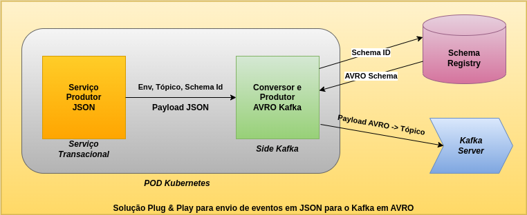

### Hi there 👋

- 🔭 I'm currently Improving Developer Experience on Data Mesh & Real Time Analytics based on GCP, Kafka & Apache Beam
- 🌱 I’ve worked on Reactive Microservices, Quarkus & Kotlin Developed, Kafka & K8s Served at AWS
- 👯 I’m looking to collaborate on Apache Beam & Kafka Open Source Projects
- 🤔 I’m looking for Disruptive Streaming Analytics Use Cases
- 🚀 I'm experimenting with Event Modelling and AsyncAPI
- 💬 Ask me about Software Architecture, Serverless, DDD, Data Mesh & Event-Driven Architecture
- 📫 How to reach me: https://www.linkedin.com/in/gpazevedo/
- ⚡ Fun fact: I feel like "I'm Back to School !"

*Converts JSON payload to Avro payload based on schemaId and publishes it to a Kafka topic*

*Kafka Dead Letter Queue on Apache Beam*

*Hotel Event Modelling*

*Syncronous Bank API*

  
*Shop Accounting*
